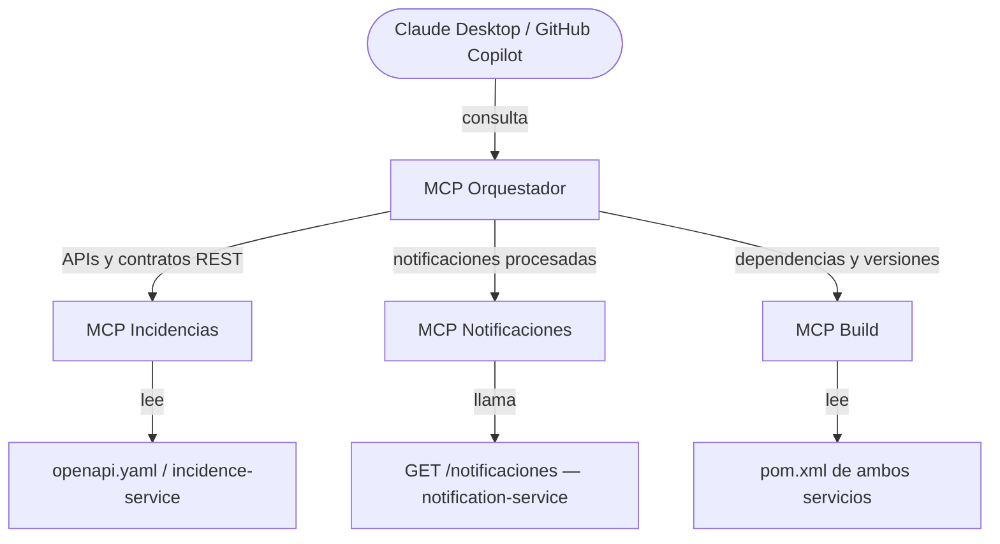

# ✅ Tarea 5 – MCP: Orquestador de MCPs, exposición de APIs backend y conexión con Claude Desktop / GitHub Copilot

## Objetivo
Diseñar e implementar una arquitectura basada en **MCPs (Model Context Protocol)** que permita:
- Exponer información técnica de los microservicios backend del proyecto (APIs, contratos, dependencias).
- Orquestar múltiples MCPs especializados mediante una capa de decisión central.
- Conectar el flujo completo con **Claude Desktop** o **GitHub Copilot local** desde un chat.

## Contexto del proyecto
El sistema está compuesto por dos microservicios backend independientes, ya desarrollados en iteraciones anteriores:

| Microservicio | Descripción | Estado |
|---|---|---|
| `incidence-service` | API REST de gestión de incidencias y usuarios. Documentada con `openapi.yaml`. | ✅ Desarrollado |
| `notification-service` | Consumidor Kafka que procesa eventos de incidencias. **Sin API REST actualmente.** | ✅ Desarrollado — API REST pendiente |

Restricciones de diseño:
- Se quiere una **cadena de MCPs especializados**, no un MCP monolítico.
- Debe existir un **MCP Orquestador** que decida a qué MCP delegar según la consulta.
- Los MCPs se implementan como **procesos stdio** compatibles con **Claude Desktop** y/o **GitHub Copilot local**.
- **No hay frontend** en el alcance de esta tarea.

## Arquitectura objetivo



### Componentes

1. **MCP Orquestador**
    - Punto de entrada único para Claude Desktop / GitHub Copilot.
    - Analiza la consulta y decide qué MCP especializado debe ejecutarse.
    - Agrega y devuelve la respuesta de forma contextual.
    - Transporte: **stdio**.

2. **MCP Incidencias**
    - Expone los contratos REST del `incidence-service`.
    - Fuente de datos: `openapi.yaml` existente.
    - Responde a consultas sobre endpoints, schemas, operaciones y ejemplos de request/response.

3. **MCP Notificaciones**
    - Expone la información del `notification-service`.
    - Requiere implementar un endpoint REST mínimo en el `notification-service` (ver Alcance).
    - Responde a consultas sobre notificaciones procesadas y estado del servicio.

4. **MCP Build**
    - Expone información de dependencias y configuración de ambos microservicios.
    - Fuente de datos: `pom.xml` del `incidence-service` y del `notification-service`.
    - Responde a consultas sobre versiones, dependencias clave y plugins Maven.

## Alcance

### 1. Extensión del `notification-service` — nueva API REST
El `notification-service` actualmente no expone ninguna API REST. Se deberá añadir **al menos un endpoint observable**, por ejemplo:

```
GET /notificaciones
```
- Devuelve la lista de notificaciones procesadas (registros en BD, logs estructurados, etc.).
- El diseño exacto del recurso es libre, pero debe devolver algo con sentido para el contexto del servicio.
- Este endpoint será la fuente de datos del **MCP Notificaciones**.

### 2. Implementación de los MCPs
- Implementar los 4 MCPs como **servidores stdio** (compatible con MCP SDK de Anthropic o implementación propia).
- Cada MCP expone sus **tools** con descripción clara para que el orquestador pueda decidir correctamente.
- El orquestador no necesita lógica de negocio: solo enrutamiento basado en descripción de la consulta.

### 3. Integración con Claude Desktop / GitHub Copilot local
- Configurar el MCP Orquestador en `claude_desktop_config.json` o en la configuración de Copilot local.
- Probar que las consultas se enrutan correctamente a cada MCP especializado.
- Documentar el proceso de configuración paso a paso.

### 4. Definición de qué información expone cada MCP
- **MCP Incidencias**: endpoints disponibles, métodos HTTP, parámetros, schemas de request/response, códigos de error.
- **MCP Notificaciones**: notificaciones procesadas, cantidad, estructura del registro, estado del servicio.
- **MCP Build**: versión de Java, versión de Spring Boot, dependencias principales (JPA, Kafka, Flyway, etc.), plugins.

## Entregables
- Documento Markdown con:
    - Diagrama de arquitectura Mermaid (actualizado si hay cambios respecto al propuesto).
    - Responsabilidad y tools expuestas por cada MCP.
    - Instrucciones de configuración para Claude Desktop / GitHub Copilot local.
    - Evidencias de uso real desde el chat (capturas o transcripciones).
    - Conclusiones y próximos pasos.
- Código fuente de los 4 MCPs.
- Endpoint REST añadido al `notification-service`.

## Criterios de éxito
Los siguientes prompts deben ser respondidos correctamente por Claude / Copilot usando los MCPs:

| Prompt de prueba | MCP esperado |
|---|---|
| *"¿Qué endpoints expone el incidence-service?"* | MCP Incidencias |
| *"¿Cuántas notificaciones se han procesado?"* | MCP Notificaciones |
| *"¿Qué versión de Spring Boot usan los microservicios?"* | MCP Build |
| *"¿Qué schema tiene el body para crear una incidencia?"* | MCP Incidencias |
| *"¿Qué dependencias de Kafka están configuradas?"* | MCP Build |

Criterios adicionales:
- El orquestador selecciona el MCP correcto en todos los casos de prueba.
- El `notification-service` expone al menos un endpoint REST funcional.
- La configuración es reproducible: otro desarrollador puede levantar los MCPs siguiendo la documentación.
- Patrón extensible: añadir un nuevo MCP no requiere modificar los existentes.
